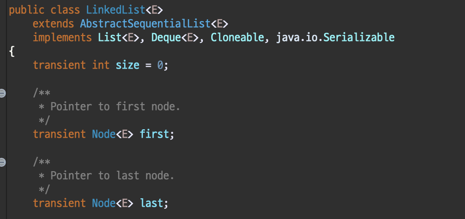
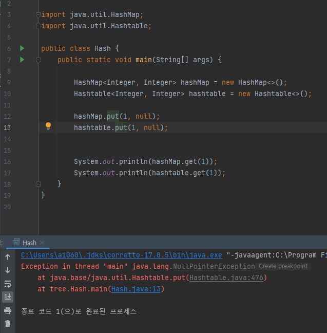

# Collection framework

### 컬렉션 프레임워크란

자바에서 다수의 데이터를 쉽고 효과적으로 처리할 수 있는 표준화된 방법을 제공하는 클래스의 집합을 말한다, 배열의 단점을 보완해주는 컬렉션

 

**컬렉션**은 다수의 데이터, **프레임워크**는 표준화된 프로그래밍 방식을 의미

그 둘을 합쳐서 데이터 그룹을 저장하는 클래스들을 표준화한 설계다→ 이를 이용해서 객체 지향적이고 재사용성 높은 코드를 작성할 수 있다

 

<b>컬렉션 프래임웍의 상속계층도</b>

출처 : [https://hudi.blog/java-collection-framework-1/](https://hudi.blog/java-collection-framework-1/)

 
Colletion의 상위에 있는 Iterable 반복, 되풀이의 의미

여기에 있는 class 들모두 객체형태, 내부 구현 또한 Object[] 배열 형태가 아닌 각각의 객체로 움직임. 각각의 데이터를 순회하며 출력하기 위해서는 사용자들이 각각의 데이터 순회 방법이나, get() 과 같은 메소드를 통해 데이터를 하나씩 가져와야 하며. lterable의 for Each 문법 사용가

현재 자바에서는 될 수 있으면 JDK 1.5부터 추가된 **향상된 for문인 Enhanced for문[ for(declaration : expression) ]**
을 사용하도록 권장하고 있다. 같은 성능을 유지하면서도 코드의 명확성을 확보하고 발생할 수 있는 버그를 예방해줄 수 있는데, 요소의 선택적 제거나 대체 등을 수행하기 위한 경우에는 iterator를 사용

 

- ****Spliterator****
    
    Spliterator는 소스의 요소 탐색 기능을 제공한다는 점은 같지만 Spliterator는 [병렬 작업](https://devbksheen.tistory.com/entry/%EB%AA%A8%EB%8D%98-%EC%9E%90%EB%B0%94-%EB%B3%91%EB%A0%AC-%EB%8D%B0%EC%9D%B4%ED%84%B0-%EC%B2%98%EB%A6%AC%EC%99%80-%EC%84%B1%EB%8A%A5-%EC%B8%A1%EC%A0%95)에 특화되어 있다.
    
    커스텀 Spliterator를 꼭 구현해야 하는 건 아니지만 Spliterator가 어떻게 동작하는지 이해한다면 [병렬 스트림 동작](https://devbksheen.tistory.com/entry/%EB%AA%A8%EB%8D%98-%EC%9E%90%EB%B0%94-%EB%B3%91%EB%A0%AC-%EB%8D%B0%EC%9D%B4%ED%84%B0-%EC%B2%98%EB%A6%AC%EC%99%80-%EC%84%B1%EB%8A%A5-%EC%B8%A1%EC%A0%95)과 관련한 통찰력을 얻을 수 있다
    
    java8은 컬렉션 프레임워크에 포함된 모든 자료구조에 사용할 수 있는 디폴트 Spliterator 구현을 제공
    

 
 

**선형 자료구조(Linear Data Structure)**

쉽게 생각해 데이터가 일렬로 연결된 형태라 보면 된다. 흔히 쓰는 int[ ] 배열같은것. 대표적 자료구조형으로 리스트(List), 큐(Queue), 덱(Deque)이 있다

 

**비선형 자료구조(Nonlinear Data Structure)**

각 요소가 여러 개의 요소와 연결 된 형태. 거미줄같은 형태로 대표적으로 그래프(Graph), 트리(Tree)가 있다

 

**집합(Set)**

보통 기타자료구조 또는 집합 자료구조로 본다. 데이터가 연결된 형식이 아닌 table에 가까운 구조라 볼수 있다

주요 인터페이스 List, Set, Map

List와 Set은 비슷한 부분이 많아서 공통 메서드만 모아 새로운 인터페이스 **컬렉션**으로 정의함

 
 

| 인터페이스 | 특징 | 구현 클래스 |
| --- | --- | --- |
| List | 순서 유지, 중복 저장 O | ArrayList, Vector, Stack, LinkedList 등 |
| Set | 순서 유지, 중복 저장 X | HashSet등 |
| Map | 키와 값을 쌍으로 저장, 순서 유지 X, 키 중복 저장 X | HashMap, Hashtable, TreeMap, Properites 등 |

 
 

### 리스트(List)

순서가 있는 데이터를 목록으로 이용. int[ ] array = new int[10]; 과 같이 사용
하지만 지정한 공간 외에는 사용 못함. IndexOutofBoundsException 에러가 발생

→ 이러한 단점 보완해 List통해 구현된 클래스들은 ‘동적 크기’ 를 가지며 배열처럼 사용할 수 있게 되었음

 

    ArrayList

    Object[ ] 배열을 사용해 내부 구현을 통해 동적으로 관리. primitive배열(ex int[ ] ) 과 유사한 형태. 최상위 타입인 Object 타입으로 배열을 생성해 사용해서 요소 접근(access elements)에서는 탁월하지만 중간의 요소를 삽입, 삭제할때는 그 뒤 요소들을 한 칸씩 밀거나 당겨야 해서 삽입, 삭제에 비효율적임

 

    LinkedLikst

    데이터와(item) 주소로 이루어진 클래스를 만들어 서로 연결함. 데이터와 주소로 이루어진 클래스를 Node(노드)라 하는데 각 노드는 이전 노드와 다음노드를 연결하는 방식이다(이중 연결 리스트라고도 함), 즉 객체끼리 연결한 방식. 요소를 검색하려 하면 찾으려는 노드 나올때 까지 모든 노드 방문해야 하지만 해당 노드 삭제, 삽입 할때는 해당 노드의 링크를 끊거나 연결만 해주면 되어서 삽입, 삭제에 효율 좋음

 

    Vector

    ArrayList와 거의 같다. Object[] 배열을 사용하며 요소 접근에서 빠른 성능을 보임. **동기화를 지원**해(여러 쓰레드 동시 데이터 접근시 순차적으로 처리하도록) 멀티 쓰레드에선 안전, 단일 쓰레드도 동기화를 해서 ArrayList에 비해 조금 느림

 

    Stack

    LIFO(Last in First out) 또는 후입선출, Stack의 경우 Vector클래스를 상속받고 있고, java에서 지원하는 Stack 클래스의 메소드들도 뜯어보면 알겠지만, 모두 Vector에 있는 메소드를 이용하여 구현되고 있어 크게 다를 것은 없다

 
 

### 큐(Queue)

선입선출(FIFO : First-in First-out) 을 위해 만들어진 인터페이스. 흔히 Stack(스택)과 많이 비교하는 자료구조. 넣은 순서대로 나온다. 가장 앞쪽을 head(헤드)라 하며 가장 후위(뒤)를 tail(꼬리)라 한다

Queue를 상속하는 Deque(덱) 이라는 Interface도 있다. Queue는 한쪽 방향(단뱡향)으로만 삽입 삭제가 된다면. Dequq는 양쪽에서 삽입 삭제가 가능한 자료구조다. head에서도 tail에서도 접근 가능하다

    LinkedList 용도

    1. List
    2. Deque
    3. Queue

LinkedList는 List와 Deque를 모두 구현할수가 있다

 

    PriorityQueue

    우선순위 큐로 선입선출의 전체 아래 짜여진다. 그 가운데 ‘데이터 우선순위’ 에 기반하여 우선순위가 높은 데이터가 먼저 나온다(낮은 숫자가 높은 우선순위 가짐)

주로 데이터들 중 최대값, 최솟값 꺼내올 때 매우 유용하다. But 사용자가 정의한 객체를 type으로 쓸 경우 반드시 Comparator 또는 Comparable을 통해 정렬 방식을 구현해줘야 한다

 
 

### 셋(Set)

‘집합’ 으로 데이터를 **중복해서 저장할 수 없다** 그리고 **입력 순서대로의 저장 순서를 보장하지 않는다**
(LinkedHashSet은 Set이지만 입력 순서대로의 저장순서를 보장한다, 하지만 중복 저장은 set과 같이 안된다)

 

    HashSet

    입력순서 보장 X, 순서보장 X 
    ex) 닉네임 만들때 ‘중복확인’ 사용, 정렬되어 있을 필요도 없고 빠르게 확인만 하면 되기에
    hash에 의해 데이터의 위치를 특정시켜 해당 데이터를 빠르게 색인(search) 할 수 있게 만드는 것 - 삽입, 삭제, 색인이 매우 빠르다

 

    LinkedHashSet

    add( ) 메소드 통해 요소들 넣은 순서대로 연결하고 입력했던 순서대로 출력된다
    ’중복은 허용하지 않으면서 순서를 보장받고 싶은경우’ 사용
    ex) 페이지 열 때 해당 페이지가 중복되는 경우 cache는 적재할 필요 없으며, 새로운 페이지 할당할때 최근 사용하지 않은 cache비울때 가장 오래된 cache비우는 것이 현명할거다. 

    ⇒ 이를 LRU알고리즘(Least Recently Used Algorithm)이라 하며 입력된(저장된) 순서를 알아야 오래된 캐시를 비울 수 있다. 

 

    TreeSet

    저장순서를 보장하진 않지만 SortedSet 인터페이스의 이름과 같이 데이터의 ‘가중치에 따른 순서’ 대로 정렬되어 보장한다. 앞서 있던 PriorityQueue는 값에 따라 정렬되어 Queue에 담겼는데 TreeSet도 마찬가지로 ‘중복되지 않으면서 특정 규칙에 의해 정렬된 형태의 집합을 쓴다’ 정렬된 형태로 있어서 특정구간 집합요소 탐색할 때 매우 유용하다
    (Tree 라는 자료구조 자체가 데이터를 일정 순서에 의해 정렬하는 구조다. 거기에 더해진 것이 바로 Set인 중복값 방지 자료구조다)

 
 

### 맵(Map)

key - value 저장 방식

 

    HashMap

    비동기며 null을 허용 제외하고는 Hashtable과 유사

    키와 값의 쌍으로 데이터 저장해서 검색속도가 빠르다

 

    TreeMap  - 범위 검색과 정렬에 유리

    이진 검색 트리로 구현

    TreeSet과 같이 데이터를 정렬해서 저장시간이 김 (TreeSet은 TreeMap을 이용해 구현함)

    Map이 필요할때 주로 HashMap 이용하며 정렬, 범위 검색에는 TreeMap 이용

 

    HashTable

    키와 값을 1대1 형태로 가져가며 동기화가 지원

    HashMap과 달리 null 입력이 불가능

    병렬 처리를 하면서 자원의 동기화를 고려해야 하는 상황이라면 해시테이블(HashTable)을 사용해야 하며, 병렬 처리를 하지 않거나 자원의 동기화를 고려하지 않는 상황이라면 해시맵(HashMap)을 사용

HashMap 에는 null값이 들어가지만 Hashtable에는 못들어감 <b>but</b> 기존 hashtable 에는 null 이 있다고 봐서 get() 명령어를 통해 꺼내게 되면 null을 가져옴

 

-------

 

Standard Template Library, 표준 템플릿 라이브러리로, 만들어져있는 알고리즘이나 컨테이너를 가져다 쓰는것

](https://img1.daumcdn.net/thumb/R1280x0/?scode=mtistory2&fname=https%3A%2F%2Fblog.kakaocdn.net%2Fdn%2FbIvfpY%2FbtqI7ysSAlg%2Fopwhvycjl6rAYfClVZNeOk%2Fimg.png)

출처 : [http://javabeans.asia](http://javabeans.asia/)

 

](https://img1.daumcdn.net/thumb/R1280x0/?scode=mtistory2&fname=https%3A%2F%2Fblog.kakaocdn.net%2Fdn%2FbvJfCL%2FbtqE41Tb07u%2FOrjegIiZkkBQzHs0Y79nu1%2Fimg.png)

출처 :  [https://indirect91.tistory.com/27](https://indirect91.tistory.com/27)

---

출처 및 참고

*[http://tcpschool.com/](http://tcpschool.com/)*

*[https://gbsb.tistory.com/247](https://gbsb.tistory.com/247)*

*[https://docs.oracle.com/javase/tutorial/collections/index.html](https://docs.oracle.com/javase/tutorial/collections/index.html)*

*[http://www.falkhausen.de/Java-8/java.util/Collection-Hierarchy.html](http://www.falkhausen.de/Java-8/java.util/Collection-Hierarchy.html)*

[https://prinha.tistory.com/entry/JAVA자료구조-자바-컬렉션-프레임워크java-collection-framework](https://prinha.tistory.com/entry/JAVA%EC%9E%90%EB%A3%8C%EA%B5%AC%EC%A1%B0-%EC%9E%90%EB%B0%94-%EC%BB%AC%EB%A0%89%EC%85%98-%ED%94%84%EB%A0%88%EC%9E%84%EC%9B%8C%ED%81%ACjava-collection-framework)